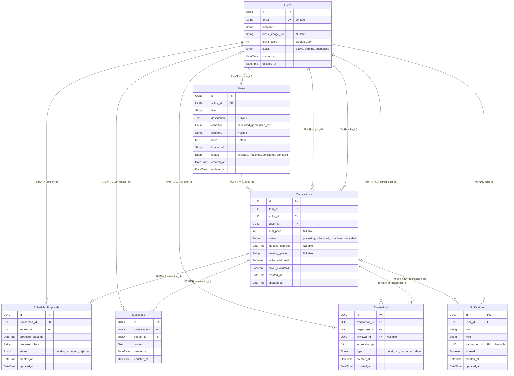

```mermaid
erDiagram
    %% Entities and Attributes
    Users {
        UUID id PK
        String email UK "Unique"
        String nickname
        String profile_image_url "Nullable"
        Int credit_score "Default: 100"
        Enum status "active, warning, suspended"
        DateTime created_at
        DateTime updated_at
    }

    Items {
        UUID id PK
        UUID seller_id FK
        String title
        Text description "Nullable"
        Enum condition "new, used_good, used_bad"
        String category "Nullable"
        Int price "Default: 0"
        String image_url
        Enum status "available, matching, completed, canceled"
        DateTime created_at
        DateTime updated_at
    }

    Transactions {
        UUID id PK
        UUID item_id FK
        UUID seller_id FK
        UUID buyer_id FK
        Int final_price "Nullable"
        Enum status "proposing, scheduled, completed, canceled"
        DateTime meeting_datetime "Nullable"
        String meeting_place "Nullable"
        Boolean seller_evaluated
        Boolean buyer_evaluated
        DateTime created_at
        DateTime updated_at
    }

    Schedule_Proposals {
        UUID id PK
        UUID transaction_id FK
        UUID sender_id FK
        DateTime proposed_datetime
        String proposed_place
        Enum status "pending, accepted, rejected"
        DateTime created_at
        DateTime updated_at
    }

    Messages {
        UUID id PK
        UUID transaction_id FK
        UUID sender_id FK
        Text content
        DateTime created_at
        DateTime updated_at
    }

    Evaluations {
        UUID id PK
        UUID transaction_id FK
        UUID target_user_id FK
        UUID reviewer_id FK "Nullable"
        Int score_change
        Enum type "good, bad, cancel, no_show"
        DateTime created_at
        DateTime updated_at
    }

    Notifications {
        UUID id PK
        UUID user_id FK
        String title
        Enum type
        UUID transaction_id FK "Nullable"
        Boolean is_read
        DateTime created_at
        DateTime updated_at
    }

    %% Relationships
    Users ||--o{ Items : "出品する (seller_id)"
    
    Users ||--o{ Transactions : "出品者 (seller_id)"
    Users ||--o{ Transactions : "購入者 (buyer_id)"
    Items ||--o{ Transactions : "対象アイテム (item_id)"
    
    Transactions ||--o{ Schedule_Proposals : "日程提案 (transaction_id)"
    Users ||--o{ Schedule_Proposals : "提案送信 (sender_id)"
    
    Transactions ||--o{ Messages : "取引連絡 (transaction_id)"
    Users ||--o{ Messages : "メッセージ送信 (sender_id)"
    
    Transactions ||--o{ Evaluations : "取引の評価 (transaction_id)"
    Users ||--o{ Evaluations : "評価される人 (target_user_id)"
    Users |o--o{ Evaluations : "評価する人 (reviewer_id)"
    
    Users ||--o{ Notifications : "通知受取 (user_id)"
    Transactions |o--o{ Notifications : "関連する取引 (transaction_id)"
```