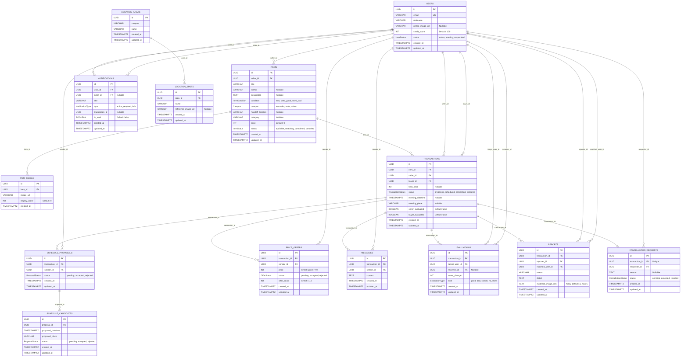

```mermaid
erDiagram
    USERS {
        UUID id PK
        VARCHAR email UK
        VARCHAR nickname
        VARCHAR profile_image_url "Nullable"
        INT credit_score "Default: 100"
        UserStatus status "active, warning, suspended"
        TIMESTAMPTZ created_at
        TIMESTAMPTZ updated_at
    }

    ITEMS {
        UUID id PK
        UUID seller_id FK
        VARCHAR title
        VARCHAR author "Nullable"
        TEXT description "Nullable"
        ItemCondition condition "new, used_good, used_bad"
        Campus campus "toyonaka, suita, minoh"
        VARCHAR handoff_location "Nullable"
        VARCHAR category "Nullable"
        INT price "Default: 0"
        ItemStatus status "available, matching, completed, canceled"
        TIMESTAMPTZ created_at
        TIMESTAMPTZ updated_at
    }

    ITEM_IMAGES {
        UUID id PK
        UUID item_id FK
        VARCHAR image_url
        INT display_order "Default: 0"
        TIMESTAMPTZ created_at
    }

    TRANSACTIONS {
        UUID id PK
        UUID item_id FK
        UUID seller_id FK
        UUID buyer_id FK
        INT final_price "Nullable"
        TransactionStatus status "proposing, scheduled, completed, canceled"
        TIMESTAMPTZ meeting_datetime "Nullable"
        VARCHAR meeting_place "Nullable"
        BOOLEAN seller_evaluated "Default: false"
        BOOLEAN buyer_evaluated "Default: false"
        TIMESTAMPTZ created_at
        TIMESTAMPTZ updated_at
    }

    SCHEDULE_PROPOSALS {
        UUID id PK
        UUID transaction_id FK
        UUID sender_id FK
        ProposalStatus status "pending, accepted, rejected"
        TIMESTAMPTZ created_at
        TIMESTAMPTZ updated_at
    }

    SCHEDULE_CANDIDATES {
        UUID id PK
        UUID proposal_id FK
        TIMESTAMPTZ proposed_datetime
        VARCHAR proposed_place
        ProposalStatus status "pending, accepted, rejected"
        TIMESTAMPTZ created_at
        TIMESTAMPTZ updated_at
    }

    PRICE_OFFERS {
        UUID id PK
        UUID transaction_id FK
        UUID sender_id FK
        INT price "Check: price >= 0"
        OfferStatus status "pending, accepted, rejected"
        INT offer_count "Check: 1..3"
        TIMESTAMPTZ created_at
        TIMESTAMPTZ updated_at
    }

    MESSAGES {
        UUID id PK
        UUID transaction_id FK
        UUID sender_id FK
        TEXT content
        TIMESTAMPTZ created_at
        TIMESTAMPTZ updated_at
    }

    EVALUATIONS {
        UUID id PK
        UUID transaction_id FK
        UUID target_user_id FK
        UUID reviewer_id FK "Nullable"
        INT score_change
        EvaluationType type "good, bad, cancel, no_show"
        TIMESTAMPTZ created_at
        TIMESTAMPTZ updated_at
    }

    REPORTS {
        UUID id PK
        UUID transaction_id FK
        UUID reporter_id FK
        UUID reported_user_id FK
        VARCHAR reason
        TEXT detail
        TEXT evidence_image_urls "Array, default: [], max 5"
        TIMESTAMPTZ created_at
        TIMESTAMPTZ updated_at
    }

    NOTIFICATIONS {
        UUID id PK
        UUID user_id FK
        UUID actor_id FK "Nullable"
        VARCHAR title
        NotificationType type "action_required, info"
        UUID transaction_id "Nullable"
        BOOLEAN is_read "Default: false"
        TIMESTAMPTZ created_at
        TIMESTAMPTZ updated_at
    }

    CANCELLATION_REQUESTS {
        UUID id PK
        UUID transaction_id FK "Unique"
        UUID requester_id FK
        TEXT reason "Nullable"
        CancellationStatus status "pending, accepted, rejected"
        TIMESTAMPTZ created_at
        TIMESTAMPTZ updated_at
    }

    LOCATION_AREAS {
        UUID id PK
        VARCHAR campus
        VARCHAR name
        TIMESTAMPTZ created_at
        TIMESTAMPTZ updated_at
    }

    LOCATION_SPOTS {
        UUID id PK
        UUID area_id FK
        VARCHAR name
        VARCHAR reference_image_url "Nullable"
        TIMESTAMPTZ created_at
        TIMESTAMPTZ updated_at
    }

    USERS ||--o{ ITEMS : "seller_id"
    ITEMS ||--o{ ITEM_IMAGES : "item_id"

    ITEMS ||--o{ TRANSACTIONS : "item_id"
    USERS ||--o{ TRANSACTIONS : "seller_id"
    USERS ||--o{ TRANSACTIONS : "buyer_id"

    TRANSACTIONS ||--o{ SCHEDULE_PROPOSALS : "transaction_id"
    USERS ||--o{ SCHEDULE_PROPOSALS : "sender_id"
    SCHEDULE_PROPOSALS ||--o{ SCHEDULE_CANDIDATES : "proposal_id"

    TRANSACTIONS ||--o{ PRICE_OFFERS : "transaction_id"
    USERS ||--o{ PRICE_OFFERS : "sender_id"

    TRANSACTIONS ||--o{ MESSAGES : "transaction_id"
    USERS ||--o{ MESSAGES : "sender_id"

    TRANSACTIONS ||--o{ EVALUATIONS : "transaction_id"
    USERS ||--o{ EVALUATIONS : "target_user_id"
    USERS |o--o{ EVALUATIONS : "reviewer_id"

    TRANSACTIONS ||--o{ REPORTS : "transaction_id"
    USERS ||--o{ REPORTS : "reporter_id"
    USERS ||--o{ REPORTS : "reported_user_id"

    USERS ||--o{ NOTIFICATIONS : "user_id"
    USERS |o--o{ NOTIFICATIONS : "actor_id"

    TRANSACTIONS ||--o| CANCELLATION_REQUESTS : "transaction_id"
    USERS ||--o{ CANCELLATION_REQUESTS : "requester_id"

    LOCATION_AREAS ||--o{ LOCATION_SPOTS : "area_id"
```
